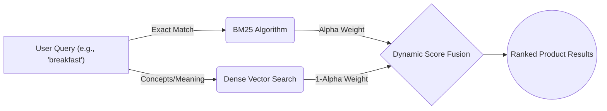
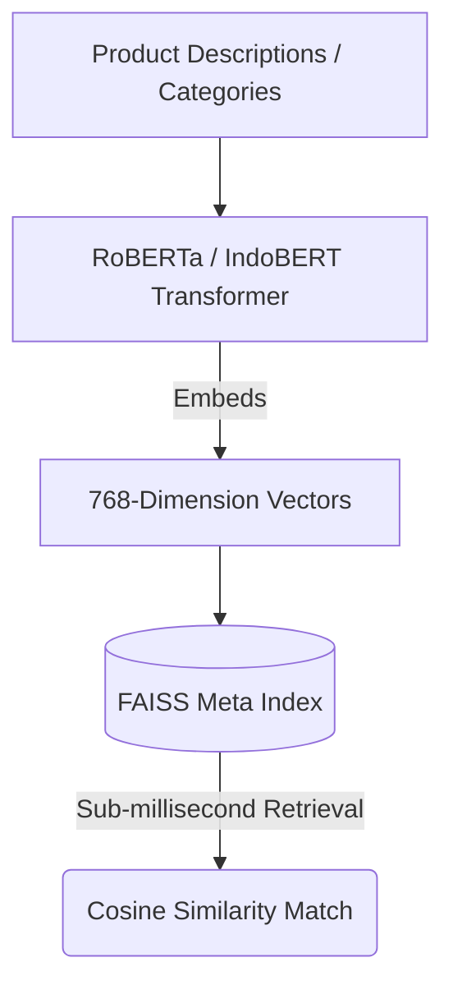
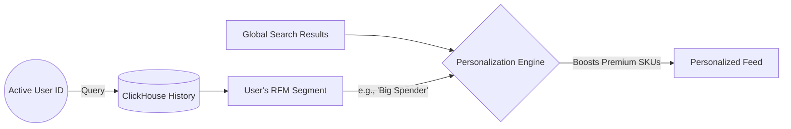
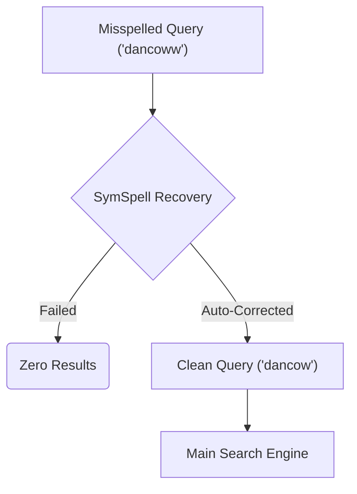
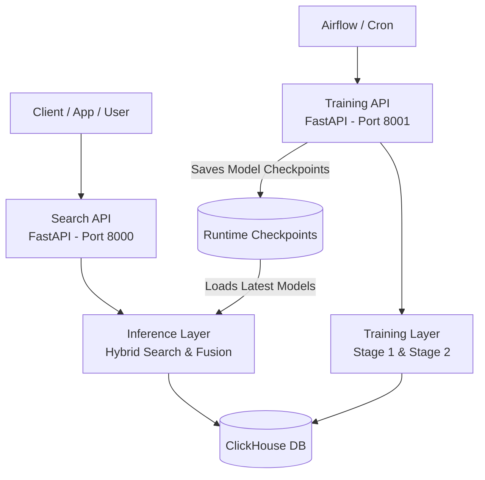

<div align="center">

# 🤖 RetailCo - NLP Hybrid Search & Recommendation API

[](https://fastapi.tiangolo.com/)
[](https://pytorch.org/)
[](https://huggingface.co/)
[](https://github.com/facebookresearch/faiss)
[](https://clickhouse.com/)

*A hybrid retrieval platform that combines lexical search, semantic embeddings, and segment-aware reranking to make large retail catalogs searchable in a way that feels useful, fast, and commercially relevant.*

[](https://alvin-agustio-hybrid-search-recommendation-api.hf.space/)
[](https://alvin-agustio-hybrid-search-recommendation-api.hf.space/docs)

</div>

---

## 🎯 Business Impact
Designed to reduce the "zero results" problem in large retail catalogs, this API understands user intent instead of relying only on exact keyword overlap. A query such as *"breakfast"* can surface cereals, oats, and related products, while segment-aware reranking adjusts the results toward the preferences of a given loyalty cohort. The result is better product discoverability and a stronger path to conversion.

---

## 🚀 Quick Start

### Public Demo: Hugging Face Space

This repository includes lightweight Docker Space packaging for a public FastAPI demo. The public demo uses a small sanitized catalog and precomputed public semantic artifacts, while the original confidential ClickHouse data and production checkpoints remain excluded.

Run the public demo locally:

```bash
pip install -r space-requirements.txt
python scripts/build_public_demo_artifacts.py
uvicorn demo_search.api:app --host 0.0.0.0 --port 7860
```

Open `http://localhost:7860/` for the interactive search tester, or `http://localhost:7860/docs` for the API docs.

Test the same container that Hugging Face Spaces will build:

```bash
docker build -t retailco-search-demo .
docker run --rm -p 7860:7860 retailco-search-demo
```

Deploy to Hugging Face Spaces:

1. Create a new Hugging Face Space and choose **Docker** as the SDK.
2. Push this repository with `Dockerfile`, `.dockerignore`, and `space-requirements.txt` at the repository root.
3. Hugging Face will build the image and run `uvicorn demo_search.api:app --host 0.0.0.0 --port 7860`.

After the Space starts, the root page serves the interactive search tester and the public API docs remain available at `/docs`.

### Original Internal Runtime

```bash
cd hybrid-search-recommendation-api/search-engine-service
pip install -r requirements.txt
uvicorn api:app --host 0.0.0.0 --port 8000
```

Swagger UI will be available at `http://localhost:8000/docs`.

Run the training service separately when needed:

```bash
uvicorn api_training:app --host 0.0.0.0 --port 8001
```

---

## 📈 Performance Snapshot

- **Average latency:** ~98.9 ms for hybrid retrieval plus reranking
- **Stage 1 quality:** `NDCG = 0.798`
- **Stage 2 quality:** `MRR Combined = 0.373`, `Recall@5 = 0.558`
- **Serving design:** inference and training are separated into distinct API services

---

## ✨ Key Features

### ⚡ 1. Hybrid Search Paradigm (Lexical + Semantic)


### 🧠 2. Conceptual Semantic Space


### 🙋‍♂️ 3. Segment Fusion (Personalization)


### 🛠️ 4. Typo Tolerance & NLP Rescue


---

## 🏗️ System Architecture

Built as a lightweight microservices ecosystem with highly decoupled Inference and Training layers.



### 🧠 Model Output & Performance
- **Stage 1 (Product Encoder):** Compresses catalog text/categories into vectors using Meta's FAISS index. Space: ~650 MB. **Score: NDCG = 0.798**.
- **Stage 2 (Query Encoder):** Aligns natural language queries with product vectors. Space: ~68 MB. **Validation alignment: Cosine Similarity ≈ 0.8**; retrieval quality: MRR Combined = 0.373.

## 🔎 Example API Usage

```bash
curl "http://localhost:8000/search?query=sarapan&top_k=10"
curl "http://localhost:8000/search?query=kopi&member_id=00000000000&top_k=10"
curl "http://localhost:8000/member/00000000000"
```

For endpoint details and operational notes, see `search-engine-service/MANUAL_GUIDE.md`.


## 🔧 What I Built

- Designed and implemented the search and training services end-to-end
- Built the hybrid retrieval pipeline that combines BM25 lexical matching with semantic vector search and score fusion
- Implemented the model-training flow for the product encoder and query encoder, including evaluation metrics and checkpoint management
- Built personalization logic that re-ranks search results using segment-based user preference signals

## 👀 How To Review This Repository

This public version focuses on **architecture and implementation review**.

1. Start with `search-engine-service/api.py` for inference flow, query normalization, and API lifecycle.
2. Review `search-engine-service/inference/hybrid_search.py` for retrieval routing and score fusion.
3. Review `search-engine-service/models/search_model.py` and `search-engine-service/models/enhanced_query_encoder.py` for model architecture.
4. Review `search-engine-service/training/train_stage1.py`, `train_stage2.py`, and `losses.py` for the training and evaluation design.

## 🗂️ Repository Guide

- `search-engine-service/api.py`: search-serving API and reload lifecycle
- `search-engine-service/api_training.py`: training job orchestration API
- `search-engine-service/inference/`: BM25, semantic retrieval, fusion, and personalization
- `search-engine-service/models/`: product and query encoder architectures
- `search-engine-service/training/`: dataset construction, losses, and training stages
- `search-engine-service/runtime/`: runtime checkpoints and job metadata

## 📌 Public Version Scope

This repository is a sanitized portfolio mirror of an internal search and recommendation system.

- The original system depended on private infrastructure, internal ClickHouse data, and excluded runtime model artifacts
- Large checkpoints, vector indexes, private catalogs, and production runtime files were intentionally removed from the public version
- The public demo path under `demo_search/` is intended to run publicly with sanitized sample data and lightweight artifacts

## Usage Notice

This repository is published for architecture and implementation review only.

- No license is granted for reuse, modification, redistribution, or production deployment without prior written permission from the author
- It is not intended to be reused as a production-ready search platform
- Full execution of the original system required private infrastructure, internal training data, and excluded runtime artifacts
- The public version is primarily meant to support technical review of model architecture, ranking logic, training design, and API structure

## Key Engineering Decisions

- **Two-stage model design for faster serving:** product representation learning and query understanding were split so inference could stay faster and deployed model artifacts could stay smaller than a fully end-to-end retrained stack
- **VM and non-GPU training constraints:** model architecture, training flow, and checkpoint handling were designed under compute limitations, which made efficiency and stability a bigger concern than raw model size
- **Loss design, sampling, and metric evaluation as first-class problems:** retrieval quality depended heavily on custom loss behavior, sampling strategy, and evaluation methodology rather than just model choice
- **Hybrid retrieval over single-path retrieval:** lexical matching and semantic search were combined to handle exact-match, fuzzy, and intent-based search behaviors more robustly than either path alone
- **Semantic-path labeling and evaluation:** the semantic side of the pipeline required deliberate labeling and validation work rather than assuming semantic retrieval quality would emerge automatically from training

## Documentation

- `search-engine-service/REPO_DOCUMENTATION.md`: system architecture and design overview
- `search-engine-service/MANUAL_GUIDE.md`: operational usage guide
- `search-engine-service/SEARCH_EVALUATION_REPORT.md`: live query evaluation notes and failure analysis


*(Note: Giant `faiss_index` databases and `.pt` neural network weights are excluded from this public repository for compliance purposes.)*

<br>
<p align="center"><i>Repository sanitized and maintained for portfolio demonstration.</i></p>
