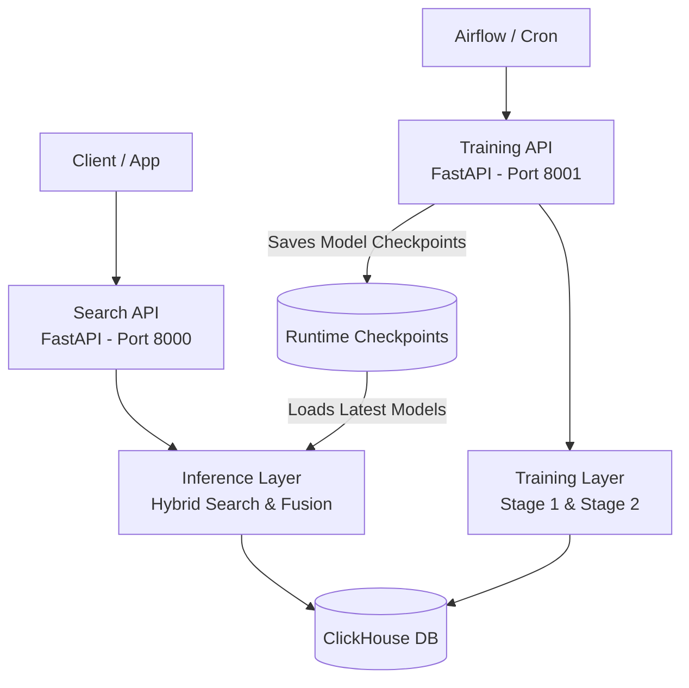

# REPO DOCUMENTATION - RetailCo Personalized Search Ecosystem

## 1. What This System Does

This project is an API-based **Search & Recommendation Engine** built with FastAPI to retrieve products and return personalized recommendations. It uses a **Hybrid Search** architecture that combines traditional lexical retrieval (BM25) with semantic vector search.

**Core value:**
- Handles typos and understands intent, not only exact text matches.
- Personalizes ranking using customer segments (RFM) and segment-level preference signals.
- Exposes all capabilities through APIs that can be integrated into a frontend, mobile app, or internal service.
- Includes a dedicated training pipeline to refresh the AI models over time.

---

## 2. System Architecture

The system is split into two standalone services in a microservice-like setup:



**Layer breakdown:**

| Layer | Main Components | Responsibility |
|-------|-----------------|----------------|
| **Search API** | `api.py` (Port 8000) | Serves `/search` requests and member profile lookups. |
| **Training API** | `api_training.py` (Port 8001) | Exposes `/jobs` endpoints to trigger model retraining. |
| **Inference Layer** | `inference/*.py` | BM25, semantic search, FAISS retrieval, and segment fusion logic. |
| **Training Layer** | `training/*.py` | Stage 1 (Product Encoder) and Stage 2 (Query Encoder) training scripts. |
| **Data Layer** | ClickHouse Connect | Reads product catalog data and customer segment data. |

---

## 3. How It Works

### A. Search Flow
1. A client sends a query along with an optional `member_id`.
2. The query is cleaned and passed into the **Hybrid Search** pipeline, which combines **BM25** and **Semantic Search** scores.
3. If confidence is too low, a spelling-correction recovery path is used as a fallback.
4. The top candidates are passed into **Segment Fusion**:
   - The system retrieves the user's RFM segment, such as `Big Spenders`.
   - Scores are reranked based on how strongly that segment prefers the relevant product classes and subclasses.
5. Final results are returned through the JSON API.

### B. Training Flow
1. The Training API receives a `start_date` and `end_date`.
2. **Stage 1 (Product Encoder)** learns product attributes, product text, and category structure, then produces product embeddings.
3. **Stage 2 (Query Encoder)** uses Stage 1 outputs together with synthetic or historical search data.
4. On success, checkpoints are promoted atomically into `runtime/checkpoints/production_stage1` and `runtime/checkpoints/production_stage2`.

---

## 4. Important Folder Structure

The application is modular. The main components are organized as follows:

```text
search-engine-service/
├── api.py                    # Search API entry point (Port 8000)
├── api_training.py           # Training API entry point (Port 8001)
├── config.py                 # Database and runtime configuration
├── requirements.txt          # Python dependencies
│
├── inference/                # Runtime inference modules
│   ├── bm25.py               # BM25 baseline and typo recovery helpers
│   ├── semantic_search.py    # Direct semantic retrieval
│   ├── hybrid_search.py      # BM25 + semantic fusion pipeline
│   └── segment_fusion.py     # Segment-based reranking
│
├── training/                 # Training pipeline
│   ├── train_stage1.py       # Product Encoder training
│   ├── train_stage2.py       # Query Encoder training
│   └── loader.py             # ClickHouse data loading for training
│
├── models/                   # Neural network architectures
│   ├── search_model.py       # Core search model
│   └── enhanced_query_encoder.py
│
└── runtime/                  # Generated runtime assets
    ├── checkpoints/          # Trained models and embeddings (.pt, .npy)
    └── jobs/                 # Training job status files (.json, .log)
```

---

## 5. Core Algorithms

| Algorithm / Method | Role in the System | Location |
|--------------------|--------------------|----------|
| **BM25** (Lexical Search) | Strong exact-term retrieval for precise keyword queries. | `inference/bm25.py` |
| **Vector Embeddings / NLP** | Encodes text into vectors so semantically related products can be found even when the keywords differ. | `models/search_model.py` |
| **Hybrid Search Fusion** | Balances lexical relevance (BM25) and semantic relevance (vector search). | `inference/hybrid_search.py` |
| **SymSpell** | Corrects severe misspellings when the main retrieval path cannot recover the intent. | `inference/bm25.py` |
| **Segment Reranking** | Boosts products that better match the customer's RFM segment preferences. | `inference/segment_fusion.py` |

---

## 6. Technologies and Libraries

- **API and server:** `fastapi`, `uvicorn`
- **Machine learning:** `torch`, `transformers`, `sentence-transformers`
- **Search infrastructure:** `faiss-cpu`, `rank-bm25`
- **Typo tolerance:** `symspellpy`
- **Database connector:** `clickhouse-connect`

---

## 7. Capabilities, Example Queries, and Current Limitations

This section explains the intended use cases of the Search API, the query types it handles well, and the current boundaries of the system.

### A. Supported Query Types
The API is designed for a real retail search bar and currently handles these query patterns:

1. **Exact match queries**: Specific product requests with clear brand, size, or variant terms.
2. **Conceptual or intent-driven queries**: Queries based on needs, situations, or usage rather than exact product names.
3. **Typo-heavy queries**: Light to moderate misspellings, handled through semantic search and spelling correction.
4. **Broad or mixed queries**: General searches that mix category and brand, such as `susu zee`.

### B. Example Behaviors

| Query Type | Example Input | Expected Behavior |
|------------|---------------|-------------------|
| **Exact Match** | `mi instan goreng 85g` | Ranks instant fried noodle products in the correct size near the top, driven mainly by BM25. |
| **Conceptual** | `sarapan` or `obat pusing` | Returns relevant breakfast products or pain-relief items even without an exact lexical match. |
| **Typo Tolerance** | `susuu`, `samphoo`, `berass` | Still returns relevant products for milk, shampoo, and rice instead of ending in zero results. |
| **Personalized** | `susu` for a `Big Spender` member | Pushes premium or larger-pack milk products higher when that segment historically prefers them. |

### C. Current Limitations
Even with machine learning, the system still has practical limitations:

1. **Cold start for new users**: Segment Fusion cannot personalize effectively for members with no mapped transaction or preference history. In that case, the system falls back to general ranking.
2. **Slang and local vocabulary coverage**: Uncommon shorthand or regional language not represented in training data can degrade semantic understanding and push the query back toward lexical retrieval.
3. **Multilingual handling is limited**: The model is primarily tuned for Indonesian retail phrasing and local product naming. Full English queries outside common retail terms may be less stable.
4. **Preference data is not real-time**: Segment preference scores are refreshed periodically from ClickHouse, so recent customer behavior is not reflected instantly.

---

## 8. Model Outputs

A full retraining cycle takes about **2.5 hours** end to end: around 15 minutes for Stage 1 and roughly 2 hours 15 minutes for Stage 2 when using one year of historical data. All model outputs are stored under `runtime/checkpoints/`.

### A. Production Stage 1 (Product Encoder)
Stage 1 learns SKU attributes such as product text, category, and brand, then maps them into vector space. Total storage footprint: **about 650 MB**.

- **`best_model.pt` (~506 MB)**: Main neural network weights for the search model.
- **`product_embeddings.npy` (~71 MB)**: Dense matrix containing vector representations for every RetailCo SKU.
- **`faiss_index` (~71 MB)** and associated metadata: High-speed vector similarity index used at query time.
- **`category_vocab.json` and `embedding_metadata.json` (~1 MB)**: Category vocabularies and index alignment metadata for stable SKU mapping.

*Current metric:* **NDCG = 0.798**

### B. Production Stage 2 (Query Encoder)
Stage 2 turns natural-language search queries into vectors that align with Stage 1 product representations. Total storage footprint: **about 68 MB**.

- **`enhanced_query_encoder.pt` (~62 MB)**: Final query encoder weights based on a HuggingFace / RoBERTa-style architecture.
- **`vocab.txt`, `tokenizer_config.json`, `special_tokens_map.json` (< 1 MB)**: Tokenizer assets required for query preprocessing.
- **`training_history.json` and `training_metadata.json`**: Training logs, hyperparameters, convergence history, and source data window metadata.

*Current metrics:* **Validation Cosine Similarity ~ 0.8 | Combined MRR = 0.373 | Recall@5 = 0.558**
